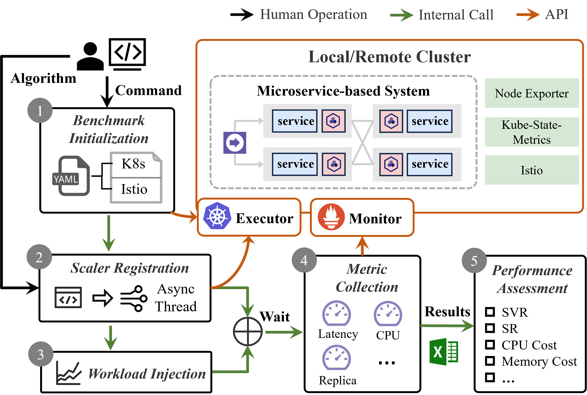
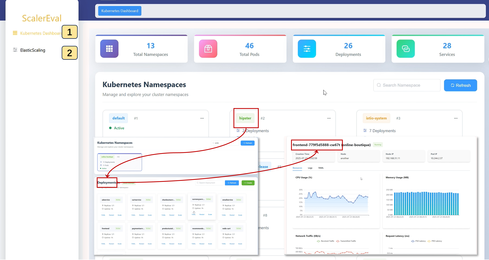
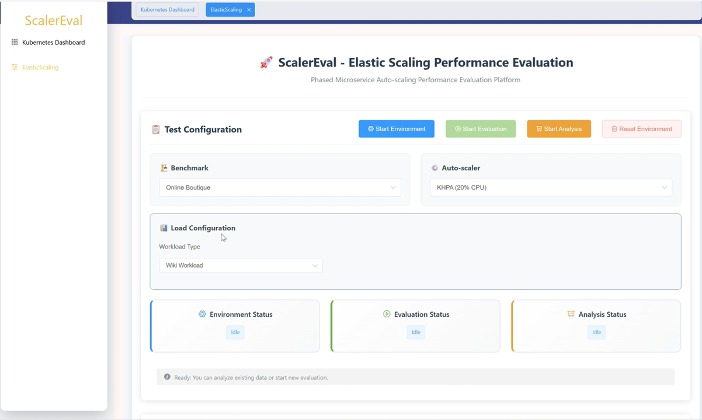
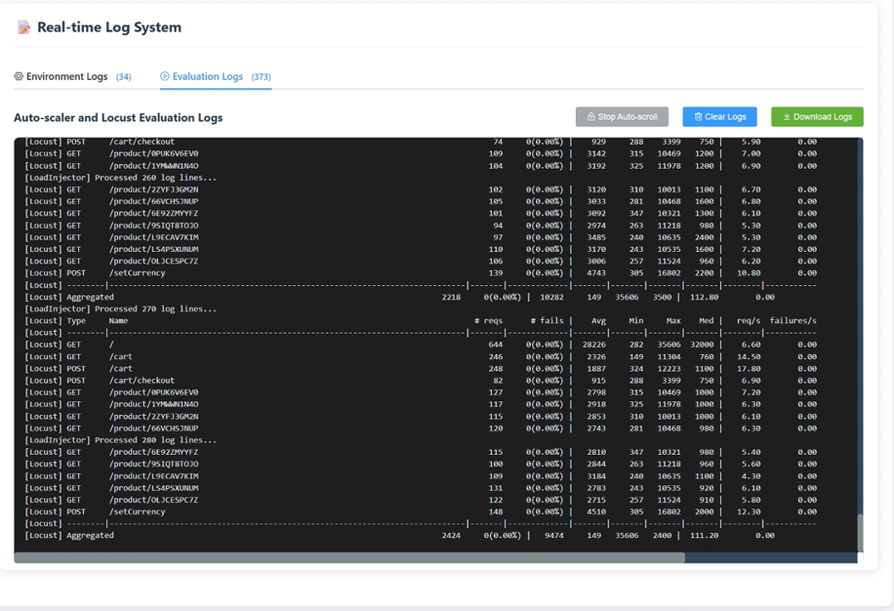
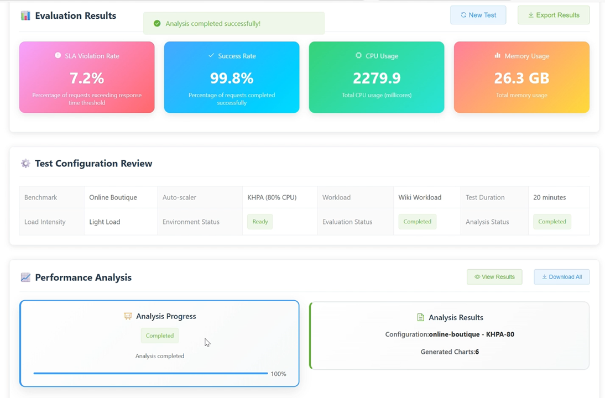

# ScalerEval
ScalerEval: Automated and Consistent Evaluation Testbed for Auto-scalers in Microservices

YouTube video presentation: https://youtu.be/HFxuXxNBTAM

**Repository**: [GitHub - WHU-AISE/ScalerEval](https://github.com/WHU-AISE/ScalerEval)

## Project Structure

- Source code of web UI: `./K8sDashboard`
- Source code of core System: `./ScalerEval`

## Introduction

ScalerEval is an end-to-end automated and consistent testbed for auto-scalers in microservices. It integrates essential fundamental interfaces for implementation of auto-scalers and orchestrates an evaluation workflow for researchers. We also provide an interactive and user-friendly web UI.

## Supported Functions

- Benchmark initialization
- Scaler registration
- Workload injection
- Metric collection
- Performance assessment
- Results visualization

## Architecture



## Pre-requirements

### Cluster Environment

- Kubernetes (1.20.4)
- Istio (1.13.4)
- Kube-State-Metrics
- Node Exporter

### Cluster Initialization Guide

For detailed cluster setup and software initialization, follow these steps:

### 1. Install Istio

Put the `./ScalerEval/libs` in your master machine of cluster.

Unzip the `istio.zip`and execute the `start.sh` to install istio.

Install the default monitoring tools of istio:

```
kubectl apply -f samples/addons
```

Note: you can delete the jaeger, as we don't use it. The pods of istio should include:

```
root@lab-desktop:/home/theory# kubectl get pods -n istio-system
NAME                                    READY   STATUS    RESTARTS   AGE
grafana-69ccf87b97-jrjlv                1/1     Running   0          48d
istio-egressgateway-6fd67b5587-lwwdk    1/1     Running   0          48d
istio-ingressgateway-568b6bffc9-dngwc   1/1     Running   0          48d
istiod-5c5c8b8877-4tnsk                 1/1     Running   0          48d
kiali-5ccffdfd97-nhvdb                  1/1     Running   0          48d
prometheus-855d6cf6c9-dfbjb             2/2     Running   0          137m
```

You should set the service type of `Prometheus` as `NodePort`. Query the ports of `Prometheus` and `istio-ingressgateway` and write them into `config/exp_config.py`:

```
root@lab-desktop:/home/theory# kubectl get svc prometheus istio-ingressgateway -n istio-system
NAME                     TYPE           CLUSTER-IP    EXTERNAL-IP       PORT(S)                AGE
prometheus              NodePort       10.98.3.135     <none>        9090:30001/TCP            48d
istio-ingressgateway   LoadBalancer   10.111.169.65   <pending>     80:32536/TCP...            48d
```

### 2. Install Kube-State-Metrics

Unzip the `kube-state-metrics.zip` and install it:

```
cd ./kube-metric
kubectl apply -f .
```

### 3. Install Node Exporters

Unzip the `node_exporters.zip` for **all nodes** and execute:

```
cd node_exporters
nohup ./node_exporter &
```

### 4. Configure Prometheus

Add the configurations of the above software into prometheus:

```yaml
scrape_configs:
- job_name: "k8s-info"
  static_configs:
  - targets: ["<master-host-ip>:30006"] # The ip:port of Kube-state-metrics.
- job_name: 'master'
  metrics_path: /metrics
  static_configs:
  - targets: ['<master-host-ip>:9100'] # The ip:port of Node Exporter.
- job_name: 'worker-1'
  metrics_path: /metrics
  static_configs:
  - targets: ['<worker-1-host-ip>:9100'] # The ip:port of Node Exporter.
...
```

If successful, you will see:


### 5. Verify Installation

Test these software using the following commands in the Prometheus dashboard:

```
# test kube-state-metrics
count(kube_pod_info{namespace="istio-system"}) by (created_by_name)
# test Node Exporter
100 - (sum by (job) (rate(node_cpu_seconds_total{mode="idle"}[1m])) * 100 /count by (job) (node_cpu_seconds_total{mode="idle"}))
```

If successful, you will see:


## Detailed Configuration

### Python Installation

- Python = 3.9.12

```
pip install -r requirements.txt
```

### Configuration Details

Configure `ScalerEval/config/exp_config.py`:

```python
class Config:
    def __init__(self):
        self.select_benchmark = 'hipster' # microservice-based systems [hipster, sockshop]
        self.select_scaler = 'None' # [None, KHPA-20, KHPA-50, KHPA-80, Showar, PBScaler]
        self.locust_exp_name = 'wiki'
        self.locust_exp_time = 1200 # Collect metrics for 1200s (modify this value based on load injection time)
        self.locust_load_dist = '1'

        # Prometheus config
        self.prom_url=f'http://192.168.31.68:30001'

        # Kubernetes config
        self.kube_config = './config/kube.yaml' # Replace with /etc/kubernetes/admin.conf from your master node

        # benchmark config
        self.benchmarks = {
            'hipster': {
                'entry': 'http://192.168.31.68:32536', # check the port of istio-ingress-gateway
                'deploy_path': './benchmarks/hipster/hipster.yaml',
                'istio_yaml': './benchmarks/hipster/istio-manifests.yaml',
                'namespace': 'hipster',
                'SLA': 500
            },
            'sockshop': {
                'entry': 'http://192.168.31.68:32536', # check the port of istio-ingress-gateway
                'deploy_path': './benchmarks/sockshop/sockshop.yaml',
                'istio_yaml': './benchmarks/sockshop/istio-manifests.yaml',
                'namespace': 'sockshop',
                'SLA': 500
            }
        }
```

## Perform Scaling using Web UI

### Build and Run with Docker

Build images and run containers:

```bash
sh build_run.sh
```

Open http://localhost:10000 to visit the Web UI.



Click the button labeled 2 and switch to the **ElasticScaling** module. Feel free to choose auto-scalers and benchmarks.



Then you can see the run-time logs



Wait for ten minutes, this page will display evaluation metrics of this experiment:




## Perform Scaling using scripts


### Execute Core Evaluation

```bash
python main.py
```

Expected output includes workload injection statistics and final performance metrics:

```
create namespace: hipster...
Namespace hipster labeled. Status: {'conditions': None, 'phase': 'Active'}
create deployments from: ./benchmarks/hipster/hipster.yaml...
Processing single file: ./benchmarks/hipster/hipster.yaml
create virtual services from: ./benchmarks/hipster/istio-manifests.yaml...
Created VirtualService frontend
Created Gateway frontend-gateway
Created VirtualService frontend-ingress
wait until all microservices are avaliable 
...
all services in hipster are avaliable
Injecting workloads
microservices in hipster: ['adservice', 'cartservice', 'checkoutservice', ...]
deleting namespace hipster...
namespace hipster was deleted.
evaluate xxx
SLO violation rate: 0.071
success rate: 1.000
CPU usage: 1723.787, Memory usage: 23481.393 MB
****************************************************************************************************
```

### Visualization

Generate visualizations of the results:

```bash
python analysis.py
```

The output images can be found in `./analysis/res/`

## Customization

### How to Add a New Benchmark

Prepare two configuration files for your benchmark:

1. `<benchmark-name>.yaml`: Lists the Kubernetes resources used in this benchmark (service, deployment, etc.)
2. `istio-manifest.yaml`: Defines the traffic routing strategy

For more details, refer to the cases in the `./benchmarks` folder.

### How to Add a New Scaler

ScalerEval provides a template for auto-scaler implementation.

1. Create a folder under the `baselines` directory using the name of your auto-scaler (e.g., `baselines/SmartScaler`)

2. Create two files in this folder: `cfg.py` and `scaler.py`

**cfg.py**:

```python
from baselines.scaler_config_template import ScalerConfig

class SmartScalerConfig(ScalerConfig):
    def __init__(self, config):
        super().__init__(config)
```

**scaler.py**:

```python
from baselines.scaler_config_template import ScalerConfig
from utils.cloud.executor import KubernetesClient
from utils.cloud.monitor import PrometheusClient

class SmartScaler(ScalerTemplate):
    def __init__(self, cfg: SmartScalerConfig, name):
        super().__init__(cfg, name)
       	self.logger = get_logger('./logs', 'SmartScaler')

    async def register(self):
        # register the scaler
        pass

    def cancel(self):
        # remove the scaler
        pass

    def scale(self, ms, replica_num):
        # scaling the replcas of a microservice to the expected count
        self.executor.patch_scale(ms, int(replica_num), self.namespace, async_req=True)
```

3. Register your scaler in `baselines/scaler_factory.py`:

```python
class ScalerFactory:
    CONFIG_CLASSES: Dict[str, Type[ScalerConfig]] = {
        # Add your scaler here
    }
```


## How to Cite

```bibtex
@misc{xie2025scalereval,
  title = {ScalerEval: Automated and Consistent Evaluation Testbed for Auto-scalers in Microservices},
  author = {Shuaiyu Xie, Jian Wang, Yang Luo, Yunqing Yong, Yuzhen Tan, Bing Li},
  year = {2025},
  url = {https://arxiv.org/abs/2504.08308} 
}
```


