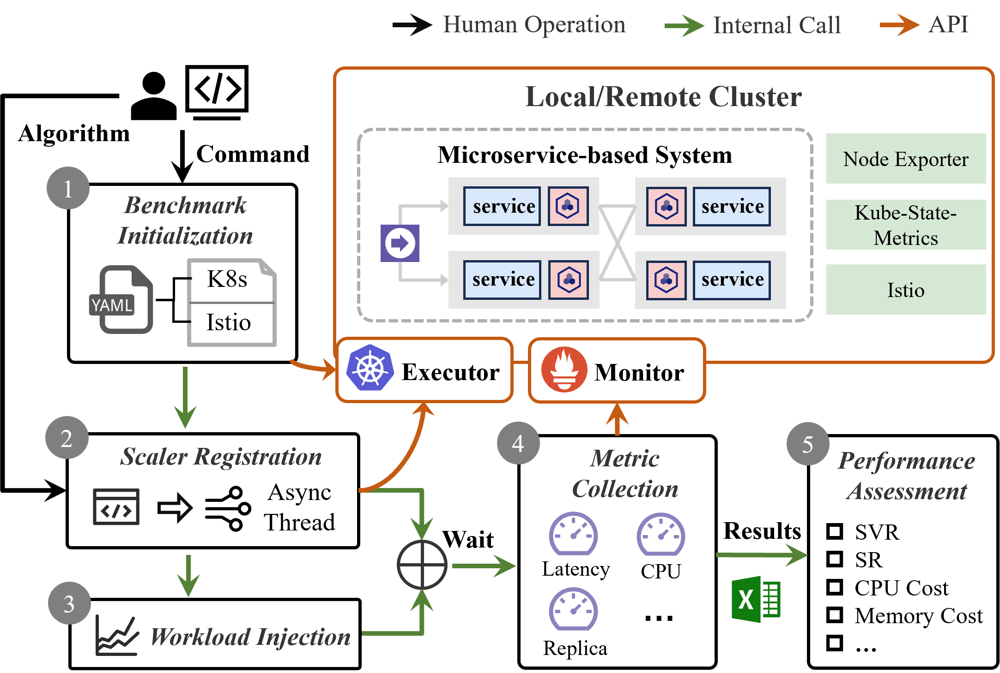

# ScalerEval
ScalerEval: Automated and Consistent Evaluation Testbed for Auto-scalers in Microservices


## ScalerEval Structure



Supported functions:

- Benchmark initialization
- Scaler registration
- Workload Injection
- Metric collection
- Performance assessment
- Results visualization

##  Pre-requirements

**Cluster Environment**

- Kubernetes (1.20.4)
- Istio (1.13.4)
- Kube-State-Metrics
- Node Exporter

The installation of these tools can be seen in [libs/README.md](https://github.com/WHU-AISE/ScalerEval/blob/main/libs/READEME.md)

## Quick Start

You can place ScalerEval on any machine outside the cluster

### Installation

- Python = 3.9.12

```
pip install requirements.txt
```

### Configuration

```Python
class Config:
    def __init__(self):
        self.select_benchmark = 'hipster' # microservice-based systems [hipster, sockshop]
        self.select_scaler = 'None' # [None, KHPA-20, KHPA-50, KHPA-80, Showar, PBScaler]
        self.locust_exp_name = 'wiki'
        self.locust_exp_time = 1200 # Collect metrics for 1200s (modify this value based on load injection time)
        self.locust_load_dist = '1'

        # Prometheus config
        self.prom_url=f'http://192.168.31.68:30001'

        # Kubernetes config
        self.kube_config = './config/kube.yaml' # You should replace this file with /etc/kubernetes/admin.conf in your master node

        # benchmark config
        self.benchmarks = {
            'hipster': {
                'entry': 'http://192.168.31.68:32536', # check the port of istio-ingress-gateway
                'deploy_path': './benchmarks/hipster/hipster.yaml',
                'istio_yaml': './benchmarks/hipster/istio-manifests.yaml',
                'namespace': 'hipster',
                'SLA': 500
            },
            'sockshop': {
                'entry': 'http://192.168.31.68:32536', # check the port of istio-ingress-gateway
                'deploy_path': './benchmarks/sockshop/sockshop.yaml',
                'istio_yaml': './benchmarks/sockshop/istio-manifests.yaml',
                'namespace': 'sockshop',
                'SLA': 500
            }
        }
```

### Running ScalerEval

```shell
python main.py
```

The expected output is as follows:

```
create namespace: hipster...
Namespace hipster labeled. Status: {'conditions': None, 'phase': 'Active'}
create deployments from: ./benchmarks/hipster/hipster.yaml...
Processing single file: ./benchmarks/hipster/hipster.yaml
create virtual services from: ./benchmarks/hipster/istio-manifests.yaml...
Created VirtualService frontend
Created Gateway frontend-gateway
Created VirtualService frontend-ingress
wait until all microservices are avaliable 
wait until all microservices are avaliable
...
all services in hipster are avaliable
Injecting workloads
Type     Name                                                                          # reqs      # fails |    Avg     Min     Max    Med |   req/s  failures/s
--------|----------------------------------------------------------------------------|-------|-------------|-------|-------|-------|-------|--------|-----------
GET      /                                                                               1083     0(0.00%) |   5606      39   14329   6800 |    4.00        0.00
GET      /cart                                                                           1475     0(0.00%) |    965      35    9208    150 |   14.30        0.00
POST     /cart                                                                           1562     0(0.00%) |   1257      69   12279    250 |   16.20        0.00
POST     /cart/checkout                                                                   487     0(0.00%) |    713      68    4589    180 |    5.30        0.00
GET      /product/0PUK6V6EV0                                                              790     0(0.00%) |   1088      37   10036    140 |    9.10        0.00
GET      /product/1YMWWN1N4O                                                              753     0(0.00%) |   1007      41   11481    150 |    7.50        0.00
GET      /product/2ZYFJ3GM2N                                                              762     0(0.00%) |   1092      36   11217    160 |    7.50        0.00
GET      /product/66VCHSJNUP                                                              784     0(0.00%) |   1147      37   10799    160 |    8.00        0.00
GET      /product/6E92ZMYYFZ                                                              783     0(0.00%) |   1060      38    9794    160 |    9.30        0.00
GET      /product/9SIQT8TOJO                                                              767     0(0.00%) |   1100      38   10315    160 |    8.60        0.00
GET      /product/L9ECAV7KIM                                                              756     0(0.00%) |   1062      33   11132    150 |    7.40        0.00
GET      /product/LS4PSXUNUM                                                              749     0(0.00%) |   1079      40    9897    170 |    8.90        0.00
GET      /product/OLJCESPC7Z                                                              807     0(0.00%) |   1085      39    9996    150 |    8.10        0.00
POST     /setCurrency                                                                    1008     0(0.00%) |   1649      55   14291    330 |    9.50        0.00
--------|----------------------------------------------------------------------------|-------|-------------|-------|-------|-------|-------|--------|-----------
         Aggregated                                                                     12566     0(0.00%) |   1510      33   14329    210 |  123.70        0.00
...
...
microservices in hipster: ['adservice', 'cartservice', 'checkoutservice', 'currencyservice', 'emailservice', 'frontend', 'paymentservice', 'productcatalogservice', 'recommendationservice', 'redis-cart', 'shippingservice']
deleting namespace hipster...
deleting namespace hipster...
deleting namespace hipster...
namespace hipster was deleted.
evaluate xxx
SLO violation rate: 0.071
success rate: 1.000
CPU usage: 1723.787 cores, Memory usage: 23481.393 MB
****************************************************************************************************
```

### Visualization

You can run this command to visualize the results:

```
python analysis.py
```

The output images can be found in `./analysis/res/`

## Usage

### How to add a new benchmark?

You should prepare two configuration files for your benchmark:

- `<benchmark-name>.yaml`: lists the Kubernetes resources used in this benchmark (service, deployment, and etc.)
- `istio-manifest.yaml`: defines the traffic routing strategy

For more details, please refer to the cases in the `./benchmark` folder.

### How to add a new scaler?

ScalerEval provides a template for auto-scaler implementation. 

Please create a folder under the `baselines` directory using the name of your auto-scaler. This folder will contain the implementation and configuration files for your custom scaler. For example, if your scaler is named `SmartScaler`, then create the folder `baselines/SmartScaler`. 

Please create two files under the `SmartScaler` folder: `cfg.py` and `scaler.py`, with the following content:

- cfg.py

```python
from baselines.scaler_config_template import ScalerConfig

class SmartScalerConfig(ScalerConfig):
    def __init__(self, config):
        super().__init__(config)
```

- scaler.py

```python
from baselines.scaler_config_template import ScalerConfig
from utils.cloud.executor import KubernetesClient
from utils.cloud.monitor import PrometheusClient

class SmartScaler(ScalerTemplate):
    def __init__(self, cfg: SmartScalerConfig, name):
        super().__init__(cfg, name)
       	self.logger = get_logger('./logs', 'SmartScaler')

    async def register(self):
        # register the scaler
        pass

    def cancel(self):
        # remove the scaler
        pass

    def scale(self, ms, replica_num):
        # scaling the replcas of a microservice to the expected count
        self.executor.patch_scale(ms, int(replica_num), self.namespace, async_req=True)
```

Finally, register your scaler into the `baselines/scalerFactory`

```python
class ScalerFactory:
    CONFIG_CLASSES: Dict[str, Type[ScalerConfig]] = {
        'None': NoneConfig,
        'KHPA': KHPAConfig,
        'Showar': ShowarConfig,
        'PBScaler': PBScalerConfig,
        'SmartScaler': SmartScalerConfig
    }
    SCALER_CLASSES: Dict[str, Type[ScalerTemplate]] = {
        'None': NoneScaler,
        'KHPA': KHPAScaler,
        'Showar': ShowarScaler,
        'PBScaler': PBScaler,
        'SmartScaler': SmartScaler
    }
```

For more details, please refer to the cases in the `./baselines` folder.

## How to Cite

```
TODO
```


