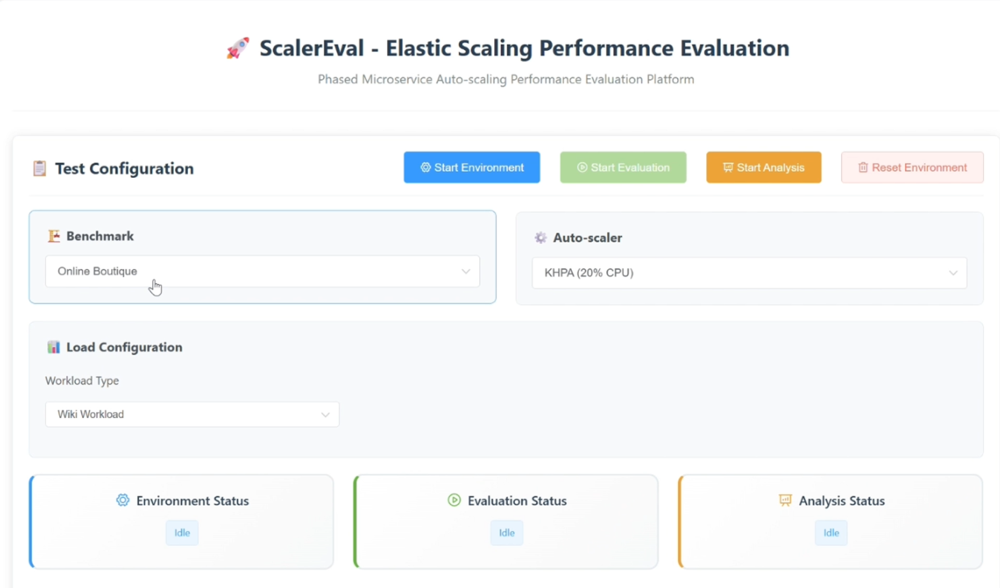
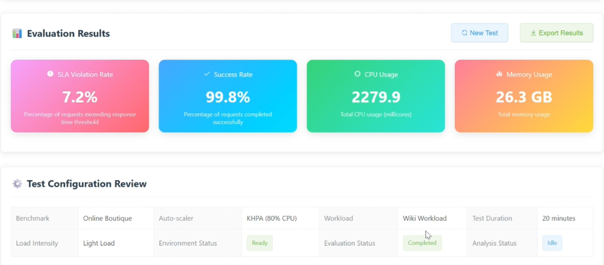

# ScalerEval
ScalerEval: Automated and Consistent Evaluation Testbed for Auto-scalers in Microservices

YouTube video presentation: https://youtu.be/HFxuXxNBTAM

- Web UI: `./K8sDashboard`
- ScalerEval:  `./ScalerEval`

## Introduction

ScalerEval is an end-to-end automated and consistent testbed for auto-scalers in microservices. ScalerEval integrates essential fundamental interfaces for implementation of auto-scalers and further orchestrates a one-click evaluation workflow for researchers. You can easily execute scripts of ScalerEval based on `README.md` in `./ScalerEval`

We also provide an interactive and user-friendly web UI. All details and guidance can be referred to the YouTube video presentation: https://youtu.be/HFxuXxNBTAM





Supported functions:

- Benchmark initialization
- Scaler registration
- Workload Injection
- Metric collection
- Performance assessment
- Results visualization

## Quick Start

1. Install necessary libraries and update configurations based on the `README.md` in `./ScalerEval`

2. Build images and run containers

```
sh build_run.sh
```

3. Open the http://localhost:10000 to visit the Web UI

## How to Cite

```
@misc{xie2025scalereval,
  title = {ScalerEval: Automated and Consistent Evaluation Testbed for Auto-scalers in Microservices},
  author = {Shuaiyu Xie, Jian Wang, Yang Luo, Yunqing Yong, Yuzhen Tan, Bing Li},
  year = {2025},
  url = {https://arxiv.org/abs/2504.08308} 
}
```


