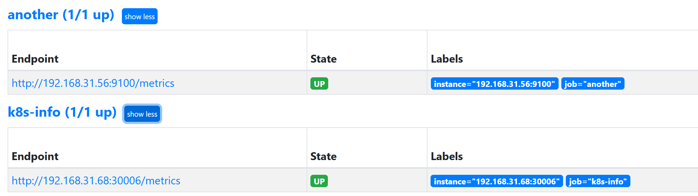

# Cluster Initialization

### Requirements

- Kubernetes

### 1. Install istio

Unzip the `istio.zip` and execute the `start.sh` to install istio.

Install the default monitoring tools of istio:

```
kubectl apply -f samples/addons
```

Note: you can delete the jaeger, as we don't use it. The pods of istio are listed as follows:

```
root@lab-desktop:/home/theory# kubectl get pods -n istio-system
NAME                                    READY   STATUS    RESTARTS   AGE
grafana-69ccf87b97-jrjlv                1/1     Running   0          48d
istio-egressgateway-6fd67b5587-lwwdk    1/1     Running   0          48d
istio-ingressgateway-568b6bffc9-dngwc   1/1     Running   0          48d
istiod-5c5c8b8877-4tnsk                 1/1     Running   0          48d
kiali-5ccffdfd97-nhvdb                  1/1     Running   0          48d
prometheus-855d6cf6c9-dfbjb             2/2     Running   0          137m
```

Subsequently, you should set the service type of `Prometheus` as `NodePort`. You can query the ports of `Prometheus` and `istio-ingressgateway`, and write them into the `config/exp_config.py`

```
root@lab-desktop:/home/theory# kubectl get svc prometheus istio-ingressgateway -n istio-system
NAME                     TYPE           CLUSTER-IP    EXTERNAL-IP       PORT(S)                AGE
prometheus              NodePort       10.98.3.135     <none>        9090:30001/TCP            48d
istio-ingressgateway   LoadBalancer   10.111.169.65   <pending>     80:32536/TCP...            48d
```

### 2. Install Kube-State-Metrics

Unzip the `kube-state-metrics.zip` and install it.

```
cd ./kube-metric
kubectl apply -f .
```

### 3. Install Node Exporters

Unzip the `node_exporters.zip` for **all nodes** and execute it.

```
cd node_exporters
nohup ./node_exporter &
```

### 4. Configure the Prometheus

You should add the configurations of the above software into prometheus:

```
scrape_configs:
- job_name: "k8s-info"
  static_configs:
  - targets: ["<master-host-ip>:30006"] # fill this field using your host ip
- job_name: 'master'
  metrics_path: /metrics
  static_configs:
  - targets: ['<master-host-ip>:9100']
- job_name: 'worker-1'
  metrics_path: /metrics
  static_configs:
  - targets: ['<worker-1-host-ip>:9100']
...
```

If successful, you will see:



